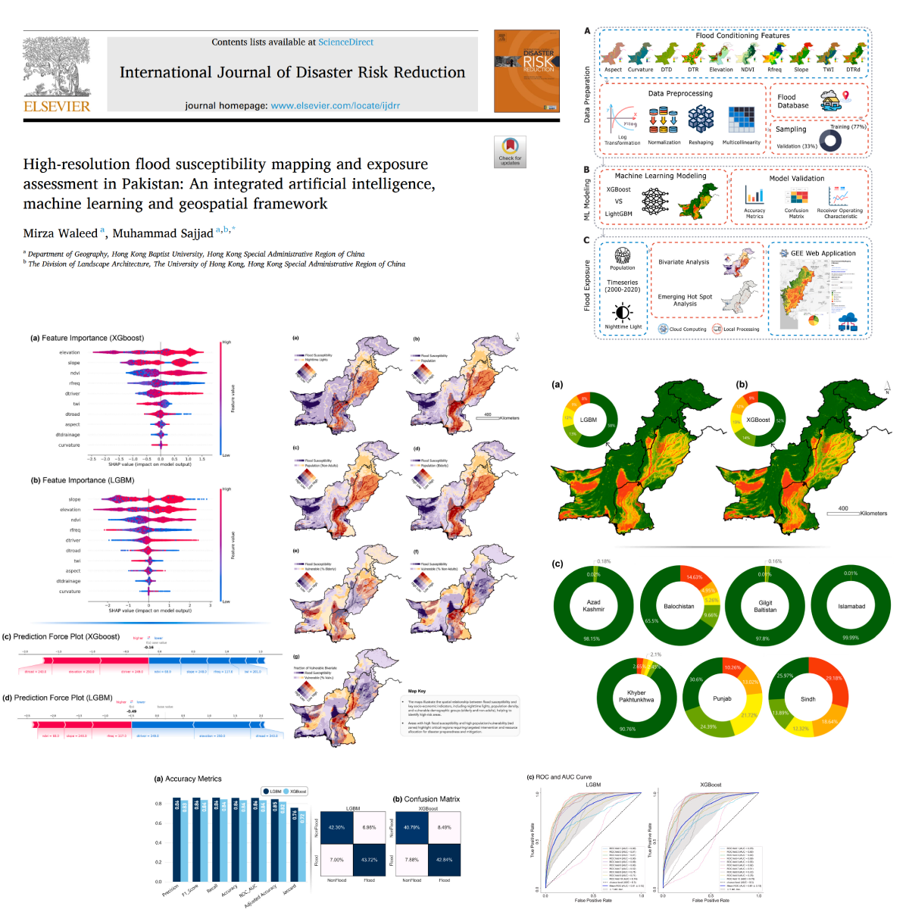

# High-resolution flood susceptibility mapping and exposure assessment in Pakistan: An integrated artificial intelligence, machine learning and geospatial framework

The paper is published and is available at [https://doi.org/10.1016/j.ijdrr.2025.105442](https://doi.org/10.1016/j.ijdrr.2025.105442).

Progress (12-May-2025): 
- This repository is under progress, and codes and relevant materials will be uploaded this week. Feel free to star the repository to get notified when the codes are available. 